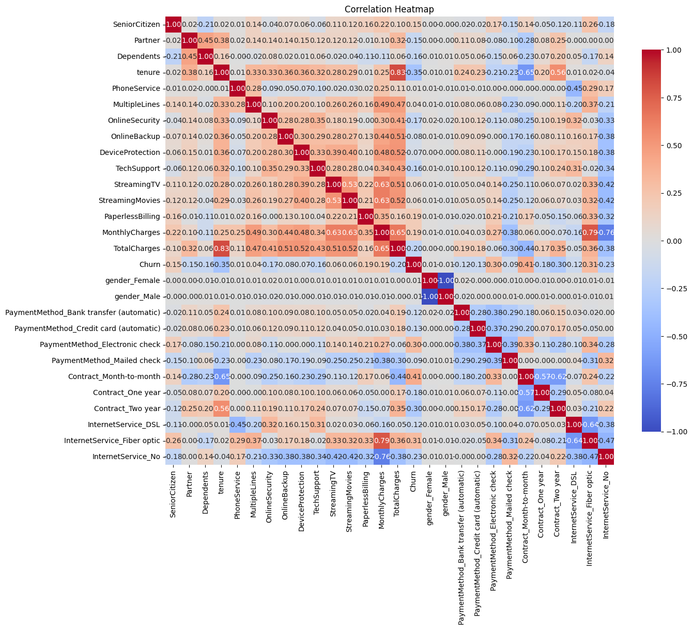
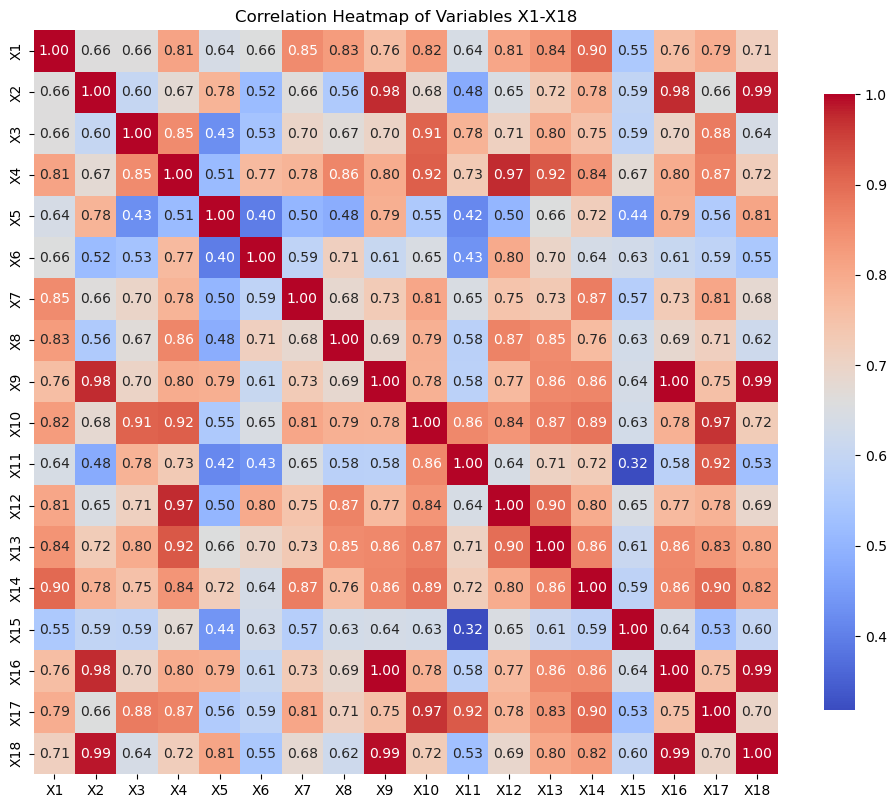
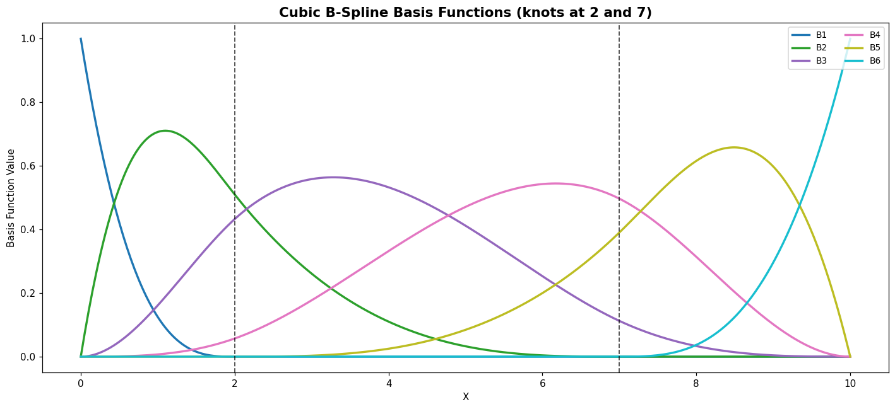
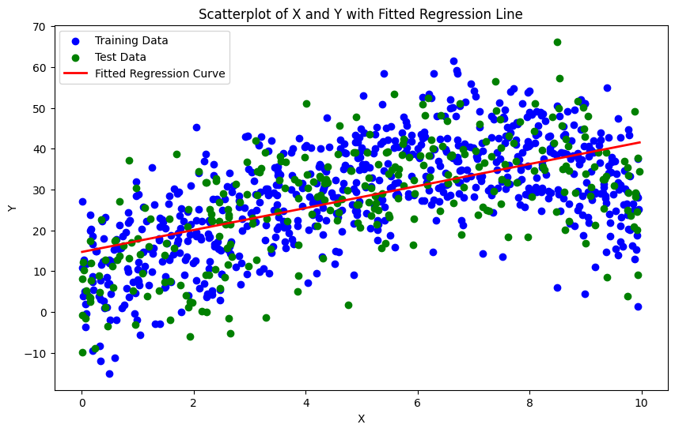
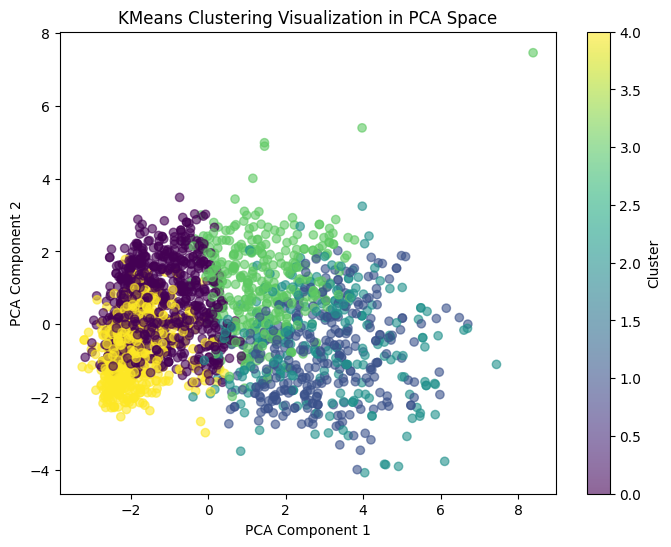
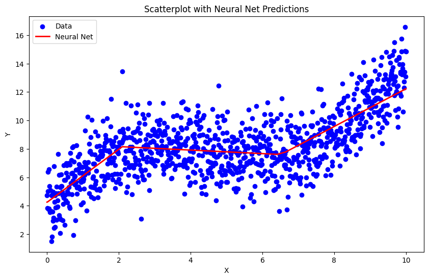
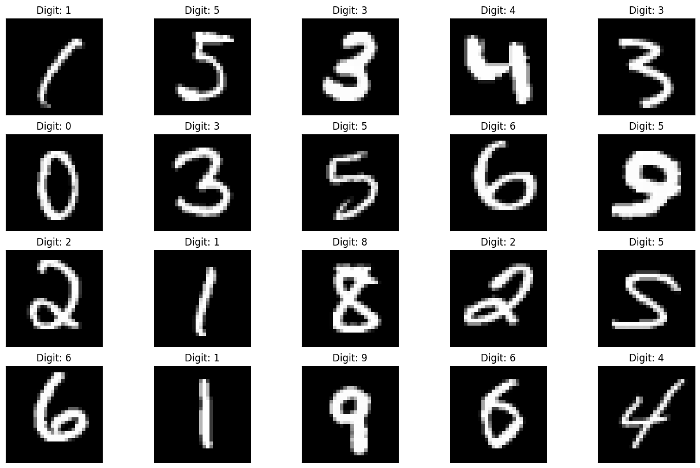

# Gen Bus 656 — Machine Learning for Business Analytics

> **33 Jupyter notebooks** from an MBA-level machine learning course covering the full ML pipeline — from classical regression and clustering to deep learning, NLP, and multi-step time-series forecasting.


---

## Preview

| Churn — Random Forest | Bankruptcy — LDA | Spline Regression | Bias–Variance |
|:---:|:---:|:---:|:---:|
|  |  |  |  |

| Marketing Clustering | Neural Network | MNIST CNN |
|:---:|:---:|:---:|
|  |  |  |

---

## Repository Structure

```
gen-bus-656-mlba/
├── 01_regression/          5 notebooks
├── 02_classification/      8 notebooks
├── 03_clustering/          2 notebooks
├── 04_nlp/                 2 notebooks
├── 05_deep_learning/       4 notebooks
├── 06_time_series/         5 notebooks
├── 07_recommenders/        2 notebooks
├── 08_assignments/         5 notebooks   ← graded work & Kaggle submissions
└── assets/                 visualisation previews
```

---

## 01 · Regression

| Notebook | Dataset | Techniques |
|---|---|---|
| [advertising_ols_regression.ipynb](01_regression/advertising_ols_regression.ipynb) | Advertising (TV / Radio / Newspaper) | OLS multiple regression, statsmodels, VIF |
| [spline_regression_demo.ipynb](01_regression/spline_regression_demo.ipynb) | Simulated polynomial data | B-spline basis, CV knot selection, bootstrap confidence bands |
| [real_estate_price_regression.ipynb](01_regression/real_estate_price_regression.ipynb) | Taiwan Real Estate (414 records) | Feature engineering, Ridge / Lasso, residual analysis |
| [garment_productivity_regression_template.ipynb](01_regression/garment_productivity_regression_template.ipynb) | Garment factory workers (1,197 records) | EDA, correlation heatmap, preprocessing pipeline — *student template* |
| [garment_productivity_xgboost.ipynb](01_regression/garment_productivity_xgboost.ipynb) | Garment factory workers | XGBoost regressor, feature importance, SHAP values |

---

## 02 · Classification

| Notebook | Dataset | Techniques |
|---|---|---|
| [american_bankruptcy_lda_rf.ipynb](02_classification/american_bankruptcy_lda_rf.ipynb) | US Bankruptcies 1999–2018 (78K panel rows, X1–X18 ratios) | LDA / QDA, Altman Z-Score, Random Forest, Fisher discriminant ratio, LDA decision regions |
| [startup_lasso_logistic.ipynb](02_classification/startup_lasso_logistic.ipynb) | Startup outcomes (923 companies) | LASSO logistic regression, Ridge, L1 regularisation path, ROC |
| [bank_marketing_classification.ipynb](02_classification/bank_marketing_classification.ipynb) | Portuguese bank telemarketing (45K calls) | Logistic Regression, Random Forest, class imbalance handling, SMOTE |
| [customer_churn_logistic.ipynb](02_classification/customer_churn_logistic.ipynb) | Telecom customer churn | Logistic Regression, feature selection, precision-recall tradeoff |
| [customer_churn_random_forest.ipynb](02_classification/customer_churn_random_forest.ipynb) | Telecom customer churn | Random Forest, hyperparameter tuning, permutation importance, calibration |
| [classification_threshold_optimization.ipynb](02_classification/classification_threshold_optimization.ipynb) | Various | Threshold sweep, F1 / precision / recall curves, business cost framing |
| [homecredit_imputation_comparison.ipynb](02_classification/homecredit_imputation_comparison.ipynb) | Home Credit (307K rows, 122 features) | 6 imputation methods compared: Mean, SVD, ALS, KNN, Regression, FAISS ANN — benchmarked via MAPE |
| [shipping_outlier_detection.ipynb](02_classification/shipping_outlier_detection.ipynb) | DataCo Supply Chain shipping records | IQR / Z-score / Isolation Forest outlier detection, anomaly flagging |

---

## 03 · Clustering & Segmentation

| Notebook | Dataset | Techniques |
|---|---|---|
| [marketing_campaign_clustering_complete.ipynb](03_clustering/marketing_campaign_clustering_complete.ipynb) | Marketing campaign (2,240 customers, 28 features) | K-Means, DBSCAN, PCA reduction, Poisson Regression, per-cluster profit/loss analysis |
| [wholesale_customer_segmentation.ipynb](03_clustering/wholesale_customer_segmentation.ipynb) | UCI Wholesale Customers (440 distributors) | Agglomerative clustering, dendrogram, silhouette analysis, cluster profiling |

---

## 04 · NLP

| Notebook | Dataset | Techniques |
|---|---|---|
| [airlines_bow_sentiment.ipynb](04_nlp/airlines_bow_sentiment.ipynb) | Twitter US Airlines Sentiment (14K tweets) | Bag-of-Words, TF-IDF, Logistic Regression, Naive Bayes, n-gram features |
| [airlines_roberta_finetuning.ipynb](04_nlp/airlines_roberta_finetuning.ipynb) | Twitter US Airlines Sentiment | RoBERTa fine-tuning (Hugging Face Transformers), tokenization, GPU training loop, F1 vs BoW baseline |

---

## 05 · Deep Learning

| Notebook | Dataset | Techniques |
|---|---|---|
| [mnist_classical_ml.ipynb](05_deep_learning/mnist_classical_ml.ipynb) | MNIST (70K digits) | Logistic Regression, Random Forest, SVM comparison on raw pixels vs PCA features |
| [mnist_cnn.ipynb](05_deep_learning/mnist_cnn.ipynb) | MNIST | PyTorch CNN (Conv→BN→Pool→FC), data augmentation, training curves, confusion matrix |
| [neural_network_simulation.ipynb](05_deep_learning/neural_network_simulation.ipynb) | Simulated data | Manual backpropagation walk-through, activation functions, gradient descent visualised |
| [bias_variance_tradeoff_demo.ipynb](05_deep_learning/bias_variance_tradeoff_demo.ipynb) | Simulated polynomial regression | Bias–variance decomposition, model complexity sweep, train/test error curves |

---

## 06 · Time Series

All five notebooks use the **M5 Walmart Sales Forecasting** dataset (42M rows, 3K+ item-store combinations, daily sales 2011–2016).

| Notebook | Scope | Techniques |
|---|---|---|
| [m5_walmart_store_forecast.ipynb](06_time_series/m5_walmart_store_forecast.ipynb) | Store-level aggregation | ETS, ARIMA, feature engineering (lags, rolling stats) |
| [m5_store_department_forecast.ipynb](06_time_series/m5_store_department_forecast.ipynb) | Store × Department | Hierarchical forecasting, cross-validation, WRMSSE metric |
| [m5_store_bottomup_aggregation.ipynb](06_time_series/m5_store_bottomup_aggregation.ipynb) | Bottom-up reconciliation | SKU → Dept → Store → Total, MinT reconciliation |
| [m5_lightgbm_forecast.ipynb](06_time_series/m5_lightgbm_forecast.ipynb) | SKU-level | LightGBM with lag / calendar / price features, WRMSSE optimisation |
| [m5_neuralprophet_forecast.ipynb](06_time_series/m5_neuralprophet_forecast.ipynb) | SKU-level | NeuralProphet (AR-Net + Prophet-style trend/seasonality components) |

---

## 07 · Recommender Systems

| Notebook | Dataset | Techniques |
|---|---|---|
| [food_preference_recommender.ipynb](07_recommenders/food_preference_recommender.ipynb) | Food preference survey | Collaborative filtering, cosine similarity, user-based CF, cold-start handling |
| [restaurant_recommender.ipynb](07_recommenders/restaurant_recommender.ipynb) | Restaurant ratings | Matrix factorisation (SVD), item-based CF, precision@K evaluation |

---

## 08 · Assignments & Projects

| Notebook | Context | What it demonstrates |
|---|---|---|
| [hw3_supply_chain_insurance_pricing.ipynb](08_assignments/hw3_supply_chain_insurance_pricing.ipynb) | **HW3** — DataCo Supply Chain (180K rows) | Logistic Regression + Random Forest for late-delivery risk; individual insurance premium pricing with 5% profit loading |
| [hw3_template.ipynb](08_assignments/hw3_template.ipynb) | **HW3** student starter template | Skeleton with data loading and evaluation stubs |
| [hw4_marketing_clustering_template.ipynb](08_assignments/hw4_marketing_clustering_template.ipynb) | **HW4** student starter template | Marketing campaign data, clustering scaffolding |
| [hw4_marketing_campaign_clustering.ipynb](08_assignments/hw4_marketing_campaign_clustering.ipynb) | **HW4 Team Submission** | Agglomerative + GMM + DBSCAN, Poisson Regression, per-cluster profit/loss analysis with business recommendations |
| [kaggle_spaceship_titanic_submission.ipynb](08_assignments/kaggle_spaceship_titanic_submission.ipynb) | **Kaggle Competition** — Spaceship Titanic | Feature engineering (cabin parsing, spending totals), XGBoost + MLP ensemble, generates `submission.csv` |

---

## Tech Stack

| Layer | Libraries |
|---|---|
| Data | `pandas`, `numpy`, `ucimlrepo`, `kaggle` |
| Classical ML | `scikit-learn`, `statsmodels`, `xgboost`, `lightgbm` |
| Deep Learning | `PyTorch`, `tensorflow` / `keras` |
| NLP | `transformers` (Hugging Face), `nltk` |
| Time Series | `neuralprophet`, `statsforecast`, `lightgbm` |
| Visualisation | `matplotlib`, `seaborn`, `plotly` |
| Notebooks | `jupyter`, `nbconvert` |

---

## Getting Started

```bash
# Clone
git clone https://github.com/<your-username>/gen-bus-656-mlba.git
cd gen-bus-656-mlba

# Install core dependencies
pip install jupyter scikit-learn xgboost lightgbm matplotlib seaborn pandas numpy statsmodels

# For deep learning notebooks
pip install torch torchvision

# For NLP notebooks
pip install transformers datasets

# For time series
pip install neuralprophet statsforecast

# Launch
jupyter notebook
```

> **Note:** Time series notebooks (M5) and the Home Credit imputation notebook require large dataset downloads. Paths in some notebooks may need updating to your local data directory.

---

## Course Overview

**Gen Bus 656 — Machine Learning for Business Analytics** covers the application of modern ML methods to business problems: customer segmentation, churn prediction, demand forecasting, credit risk, NLP for sentiment analysis, and deep learning for image recognition. The course emphasises interpretability, business framing of model outputs, and the full pipeline from raw data to actionable insight.

---

*Notebooks generated and organised for portfolio reference — MBA coursework, 2024–2025.*
